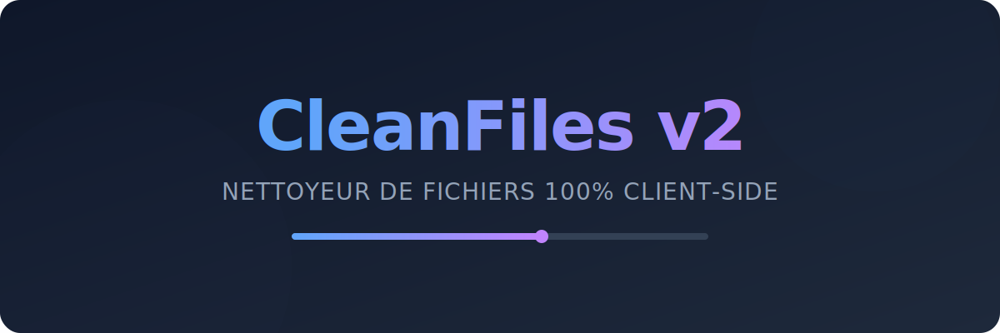

<div align="center">



# ⚡ CleanFiles v2

**L'outil ultime et ultra-rapide pour nettoyer et renommer vos fichiers en masse, directement dans votre navigateur.**

[](https://github.com/Septieme7/CleanFiles-v2/stargazers)
[](LICENSE)
[](https://septieme7.github.io/CleanFiles-v2/)
[](https://github.com/Septieme7/CleanFiles-v2)

[**🌐 Essayer la démo en direct**](https://septieme7.github.io/CleanFiles-v2/) • [**Signaler un bug**](https://github.com/Septieme7/CleanFiles-v2/issues) • [**Demander une fonctionnalité**](https://github.com/Septieme7/CleanFiles-v2/issues)

</div>

<br>

> **Fini les noms de fichiers chaotiques.** CleanFiles supprime les emojis, normalise les espaces, convertit les casses (camelCase, snake_case...) et exporte tout proprement dans un ZIP. **Zéro serveur, zéro délai, 100% privé.**

## 🚀 Pourquoi CleanFiles ?

- 🛡️ **Confidentialité absolue :** Tout se passe dans votre navigateur. Aucun fichier n'est uploadé sur un serveur distant.
- ⚡ **Performances extrêmes :** Renommez 500 fichiers en moins d'une seconde.
- 📱 **PWA Ready :** Installez-le comme une application native et utilisez-le hors-ligne.
- 📦 **Export intelligent :** Téléchargement individuel ou empaquetage automatique dans un fichier `.zip`.

---

## 📸 Démonstration

*(Glissez-déposez, nettoyez, exportez. C'est aussi simple que ça).*

<div align="center">
  
</div>

---

## ✨ Fonctionnalités clés

| Nettoyage Intelligent 🧹 | Formats & Casses 🔠 | Fonctionnalités Avancées 🛠️ |
| :--- | :--- | :--- |
| • Suppression caractères spéciaux<br>• Éradication des emojis<br>• Normalisation des espaces multiples<br>• Conservation sécurisée des extensions | • `camelCase`<br>• `PascalCase`<br>• `snake_case`<br>• `kebab-case` | • Ajout de préfixes / suffixes<br>• Horodatage dynamique (Date/Heure)<br>• Gestion intelligente des doublons<br>• Mode Texte & Mode Drag'n'Drop |

---

## 🛠️ Installation & Lancement Rapide

Aucun backend n'est nécessaire. Clonez, ouvrez, et c'est parti.

```bash
# 1. Cloner le dépôt
git clone [https://github.com/Septieme7/CleanFiles-v2.git](https://github.com/Septieme7/CleanFiles-v2.git)
```

# 2. Entrer dans le dossier
cd CleanFiles-v2

# 3. Lancer l'application (ouvrez simplement le fichier)
open index.html # ou double-cliquez dessus dans votre explorateur
🧪 Benchmarks de PerformanceTesté sur un navigateur moderne avec des fichiers de taille variable.Nombre de FichiersTemps de Traitement (Local)50< 100 ms200~ 300 ms500 (Max conseillé)~ 800 msLimites actuelles du navigateur : 2Go par fichier / 10Go au total par lot.🏗️ Architecture du ProjetUne structure de code claire, propre, et sans dépendances lourdes (Vanilla JS).PlaintextCleanFiles-v2/
├── index.html          # Interface Mode Texte
├── upload.html         # Interface Drag & Drop (JSZip)
├── assets/
│   ├── css/style.css   # Styles globaux UI/UX
│   ├── js/
│   │   ├── script.js   # Logique métier & transformations
│   │   └── upload.js   # Gestion File API & Export ZIP
│   └── manifest/       # Configuration PWA
└── docs/               # Ressources README (Bannière, GIFs)
🗺️ RoadmapNous avons de grandes ambitions pour CleanFiles. Voici ce qui arrive :[ ] Preview Live : Voir les changements de noms avant de valider.[ ] Règles personnalisées (Regex) : Pour les power users.[ ] Export CSV : Obtenir un mapping "Ancien Nom -> Nouveau Nom".[ ] Version Desktop native : Application Electron autonome.🤝 ContribuerLes PRs (Pull Requests) sont fortement encouragées ! Vous voulez ajouter une feature ou optimiser le code ?Forkez le projetCréez votre branche (git checkout -b feature/AmazingFeature)Committez vos changements (git commit -m 'Add some AmazingFeature')Poussez la branche (git push origin feature/AmazingFeature)Ouvrez une Pull Request📝 FAQ<details><summary><strong>Mes fichiers sont-ils envoyés sur Internet ?</strong></summary><strong>Non, jamais.</strong> CleanFiles utilise l'API File HTML5. Toutes les manipulations se font dans la mémoire vive de votre navigateur. Une fois la page fermée, tout disparaît.</details><details><summary><strong>Puis-je l'utiliser sans connexion internet ?</strong></summary><strong>Oui !</strong> Le projet inclut un Manifest PWA. Chargez la page une fois, et elle fonctionnera même dans l'avion.</details><details><summary><strong>Est-ce que mes paramètres de renommage sont conservés ?</strong></summary><strong>Oui.</strong> Nous utilisons le localStorage de votre navigateur pour sauvegarder vos préférences d'une session à l'autre.</details><div align="center">👤 Auteurseptieme7 GitHub • Site du Projet📝 Licence MIT - Sentez-vous libre d'utiliser et de modifier le code.Si cet outil vous fait gagner du temps, n'hésitez pas à laisser une ⭐ !</div>